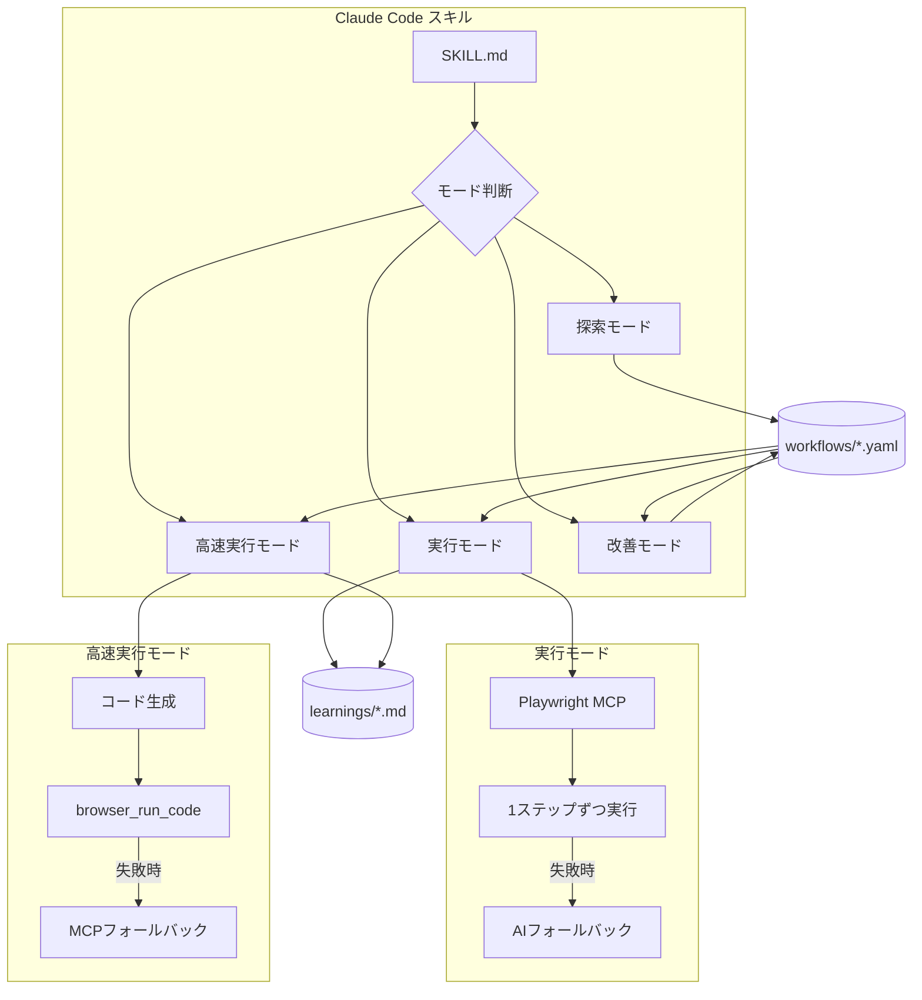

# Browser Automation Skill

Claude Code 用のブラウザ自動化スキル。Playwright MCP を使用してブラウザ操作を自動化。

## セットアップ

### Playwright MCP サーバーの追加

```bash
claude mcp add playwright npx @playwright/mcp@latest
```

## アーキテクチャ



## 4つのモード

| モード | 用途 | トリガー |
|--------|------|----------|
| **探索モード** | 新しいワークフローを対話的に構築 | 「探索モードで構築」「ワークフローを作成」 |
| **実行モード** | YAMLを読み込んで自動実行 | 「ワークフローを実行」「.yamlを実行」 |
| **高速実行モード** | Playwrightコードで一括実行 | 「高速実行」「クイック実行」「fast」 |
| **改善モード** | 学びを基にYAMLを改善 | 「学びを基に修正」「YAMLを改善」 |

### モード比較

| 項目 | 実行モード | 高速実行モード |
|------|------------|----------------|
| 実行方式 | MCP経由で1ステップずつ | Playwrightコード一括実行 |
| スナップショット | 各ステップで取得 | 不要 |
| フォールバック | `ai_search` 対応 | MCP補助のみ |
| トークン消費 | 多い | 最小限 |
| 速度 | 遅い | 高速 |
| コードキャッシュ | なし | あり |

### 高速実行モードの特徴

#### 1. コードキャッシュ

YAMLからPlaywrightコードを生成し、`generated/` に保存。2回目以降はコード生成をスキップ。

```
初回実行:
  YAML読込 → コード生成 → generated/ に保存 → 実行

2回目以降:
  YAML読込 → generated/ からキャッシュ読込 → 実行（生成スキップ）

YAML更新時:
  ハッシュ不一致検出 → 再生成 → キャッシュ更新 → 実行
```

#### 2. MCPフォールバック + 途中再開

失敗したステップのみMCPで補助し、続きは高速実行で再開。

```
┌─────────────────────────────────────────────┐
│  browser_run_code (全ステップ試行)          │
│  ✅ Step 0: navigate → 成功                 │
│  ✅ Step 1: click → 成功                    │
│  ❌ Step 2: click → タイムアウト            │
│  return { failedStep: 2, selector: '...' }  │
└─────────────────────────────────────────────┘
          ↓ failedStep=2 を確認
┌─────────────────────────────────────────────┐
│  MCP補助 (失敗したステップのみ)             │
│  ├─ browser_snapshot で状態確認             │
│  └─ browser_click でクリック実行            │
└─────────────────────────────────────────────┘
          ↓ startFromStep: 3 で再開
┌─────────────────────────────────────────────┐
│  browser_run_code (Step 3 から再開)         │
│  ✅ Step 3: fill → 成功                     │
│  ✅ Step 4: click save → 成功               │
│  return { success: true }                   │
└─────────────────────────────────────────────┘
```

### どちらを使うべきか

| ユースケース | 推奨 | 理由 |
|-------------|------|------|
| 初回実行・検証 | 実行モード | フォールバックで成功率UP |
| サイト変更後 | 実行モード | AIがセレクタを自動修正 |
| ワークフロー開発中 | 実行モード | 試行錯誤しやすい |
| 安定したワークフロー | 高速実行 | 高速、トークン節約 |
| 繰り返し実行 | 高速実行 | キャッシュで2回目以降さらに高速 |

### 典型的なワークフロー


## ディレクトリ構成

```
rpa-autoheal-skill/
├── README.md                 # このファイル
├── package.json              # 依存関係とnpmスクリプト
├── run-workflow.js           # スタンドアロン実行ランナー
├── .mcp.json                 # MCP設定
│
├── schemas/                  # JSON Schema定義
│   └── workflow.schema.json  # ワークフローYAML用スキーマ
│
├── scripts/                  # ユーティリティスクリプト
│   └── yaml-to-js.js         # YAML→JS決定論的変換CLI
│
├── tests/                    # テストスイート
│   ├── workflow-schema.test.js   # スキーマ検証テスト
│   ├── yaml-to-js.test.js        # 変換ロジックテスト
│   ├── integration.test.js       # 統合テスト
│   └── e2e-workflow.test.js      # E2Eワークフローテスト
│
├── .claude/
│   └── skills/               # Claude Codeスキル本体
│       ├── rpa-explore/      # 探索モード
│       └── rpa-execute/      # 実行モード
│
├── workflows/                # ワークフローYAML定義
├── generated/                # 生成されたJSテンプレートキャッシュ
└── learnings/                # 学びレポート
```

## 参照ファイルの役割

### SKILL.md - エントリポイント

ユーザーの指示からモードを判断し、適切な references/ ファイルに誘導。

### references/explore.md - 探索モード

| 内容 | 説明 |
|------|------|
| フロー | 記録 → テスト → 改善 |
| セレクタ取得 | `browser_evaluate` でCSSセレクタを取得 |
| YAML出力 | 操作完了後に `workflows/` に保存 |

### references/execute.md - 実行モード

| 内容 | 説明 |
|------|------|
| フロー | YAML読込 → Task起動 → 1件ずつ実行 |
| フォールバック | `ai_search` でスナップショット解析 |
| 学びレポート | `learnings/` に出力 |

### references/fast-execute.md - 高速実行モード

| 内容 | 説明 |
|------|------|
| フロー | YAML → コード生成 → `browser_run_code` |
| キャッシュ | `generated/` に保存、2回目以降は生成スキップ |
| MCPフォールバック | 失敗ステップのみMCPで補助 |

### references/improve.md - 改善モード

| 内容 | 説明 |
|------|------|
| 入力 | 学びレポート + ユーザー指示 |
| 出力 | 改善されたYAML |
| 機能 | 条件分岐追加、セレクタ修正、ステップ追加 |

## YAML構造

`schemas/workflow.schema.json` でバリデーション。主要な要素：

```yaml
name: workflow-name          # 必須: kebab-case
description: ワークフローの説明

input:                       # 入力パラメータ定義
  search_keyword:
    type: string
    required: true
    description: "検索キーワード"
    example: "laptop"

constants:                   # 定数値
  base_url: "https://example.com"
  timeout: 5000

steps:                       # 自動化ステップ（配列）
  - name: ページを開く
    action: navigate
    url: "${constants.base_url}"

  - name: 検索入力
    action: fill
    selector: "#search"
    value: "${input.search_keyword}"
    hint: "検索ボックス"          # AI fallback用ヒント

  - name: 高額時のみ実行           # 条件分岐
    action: fill
    selector: "#extra"
    value: "追加情報"
    when:
      field: extract.amount
      op: ">"
      value: 10000

  - name: 複数条件（AND）
    action: click
    selector: "#submit"
    when:
      match: all
      conditions:
        - { field: input.enabled, op: "==", value: true }
        - { field: extract.count, op: ">", value: 0 }

output:                      # 出力定義（オプション）
  result:
    description: "検索結果"
```

### アクション一覧

| action | 用途 | 必須パラメータ | オプション |
|--------|------|----------------|------------|
| `navigate` | URL移動 | `url` | - |
| `fill` | テキスト入力 | `selector`, `value` | `hint` |
| `click` | クリック | `selector` | `hint` |
| `press` | キー入力 | `selector`, `key` | `hint` |
| `wait` | 要素待機 | `selector` | `timeout` |
| `playwright_code` | カスタムコード | `code` | `output` |

### セレクタ形式

高速実行で動作するCSSセレクタを使用：

```yaml
# OK - CSSセレクタ + Playwright拡張
selector: "#element-id"
selector: "[id='spaced id']"
selector: "[name='field']"
selector: "[aria-label*='Label']"
selector: "li:has-text('Option')"

# NG - MCP専用（高速実行不可）
selector: "combobox[name='...']"
selector: "textbox[name='...']"
```

## 使用例

### 探索モードでワークフロー作成

```
ユーザー: 「https://example.com のワークフローを探索モードで構築して」
```

### 実行モードで自動化

```
ユーザー: 「myte-expense-entertainment を実行して。領収書は receipt.jpg」
```

### 高速実行

```
ユーザー: 「myte-expense-entertainment を高速実行して」
```

### 改善モードでYAML修正

```
ユーザー: 「学びレポートを基にYAMLを修正して」
```

## 開発

### セットアップ

```bash
npm install
```

### npm スクリプト

| コマンド | 説明 |
|----------|------|
| `npm test` | 全テスト実行 |
| `npm run test:schema` | スキーマ検証テストのみ |
| `npm run test:yaml-to-js` | YAML→JS変換テストのみ |
| `npm run test:integration` | 統合テストのみ |
| `npm run convert -- <input.yaml>` | YAMLをJSに変換 |

### YAML→JS 決定論的変換

ワークフローYAMLをPlaywright実行可能なJSテンプレートに変換する機能。AIを介さない純粋な機械的変換。

#### 使い方

```bash
# 基本使用（outputは generated/<workflow-name>.template.js に自動生成）
node scripts/yaml-to-js.js workflows/amazon-product-search.yaml

# 出力先を指定
node scripts/yaml-to-js.js workflows/amazon-product-search.yaml output/custom.js
```

#### 変換の流れ


#### 主な機能

| 機能 | 説明 |
|------|------|
| **スキーマ検証** | JSON Schemaで構文エラーを事前検出 |
| **変数補間** | `${input.xxx}`, `${extract.xxx}`, `${constants.xxx}` を展開 |
| **条件分岐** | `when` 句をJavaScript条件式に変換 |
| **アクション変換** | navigate, fill, click, press, wait, playwright_code に対応 |

#### サポートされるアクション

| action | 生成されるPlaywrightコード |
|--------|---------------------------|
| `navigate` | `page.goto(url)` |
| `fill` | `page.locator(selector).fill(value)` |
| `click` | `page.locator(selector).click()` |
| `press` | `page.locator(selector).press(key)` |
| `wait` | `page.locator(selector).waitFor({ timeout })` |
| `playwright_code` | カスタムコードをそのまま埋め込み |

## スタンドアロン実行（run-workflow.js）

Claude を介さずに直接ワークフローを実行するランナー。

### 使い方

```bash
node run-workflow.js <workflow-name> <input-path> [options]
```

### オプション

| オプション | 説明 | デフォルト |
|-----------|------|-----------|
| `--charge-code <code>` | Charge Code | CKFEV001 |
| `--start-from <step>` | 開始ステップ番号（途中再開用） | 0 |
| `--max-retries <n>` | 失敗時のリトライ回数 | 3 |
| `--extract <json>` | 抽出データをJSON文字列で指定 | - |

### 例

```bash
# 基本実行（--extract 必須）
node run-workflow.js myte-expense-entertainment "C:\receipt.jpg" ^
  --extract "{\"amount\":\"7000\",\"date\":\"2025/12/25\",\"restaurant_name\":\"Miyachi\",\"vat_number\":\"T123\",\"meal_type\":\"Lunch\"}"

# Charge Code 指定
node run-workflow.js myte-expense-entertainment "C:\receipt.jpg" ^
  --charge-code CKFEV002 ^
  --extract "{\"amount\":\"7000\",\"date\":\"2025/12/25\",\"restaurant_name\":\"Miyachi\",\"vat_number\":\"T123\",\"meal_type\":\"Lunch\"}"

# 途中から再開 (Step 5 から)
node run-workflow.js myte-expense-entertainment "C:\receipt.jpg" --start-from 5 --extract "..."

# リトライ回数を増やす
node run-workflow.js myte-expense-entertainment "C:\receipt.jpg" --max-retries 5 --extract "..."
```

**Note**: OCR抽出はClaude経由でのみ可能。ランナーは `--extract` で抽出済みデータが必要。

### Claude経由との違い

| 機能 | Claude経由 | ランナー直接 |
|------|------------|--------------|
| MCPフォールバック | ✅ AI判断で補助 | ❌ なし |
| 失敗時の対応 | snapshot→click→再開 | リトライ→終了 |
| リトライ | 自動（AI判断） | 同じステップを数回 |
| OCR抽出 | ✅ | ❌（`--extract`で指定） |
| 速度 | 普通 | 高速 |

### 推奨ユースケース

- **Claude経由**: 初回実行、不安定なワークフロー、OCR抽出が必要
- **ランナー直接**: 検証済みワークフロー、繰り返し実行、CI/CD組み込み
