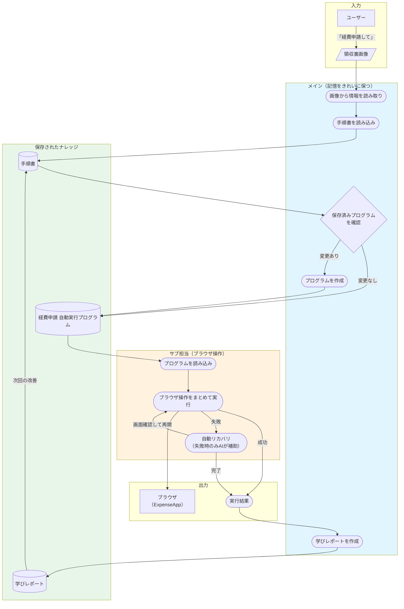

# Skillの育て方 - ブラウザ自動化Skillの進化ストーリー

## ExpenseApp経費申請の完成形



**ポイント**:
- **メイン**: 画像解析・手順書読み込み・レポート作成（記憶をきれいに保つ）
- **サブ担当**: ブラウザ操作のみ担当（何件でも安定処理）
- **30秒/件**: 高速実行で、毎回AIが画面確認しなくてOK
- **自動リカバリ**: 失敗したステップだけAIが補助
- **学習ループ**: 失敗→学びレポート→手順書改善→次回成功

---

## 目的

このドキュメントは、ブラウザ自動化Skillが初期状態から徐々に機能を高度化していった過程を、実際のユーザーとClaudeのやり取りを想定して記録したものです。

**学べること**:
- Skillをどのように育てていくか
- 壁打ちしながら徐々に改善する手法
- 初期のAI任せから、手順書保存、高速化、学習への進化
- 組織のナレッジとして蓄積していく方法

---

## Phase 1: 完全お任せモード（初期状態）

### Day 1: 最初の自動化リクエスト

```
ユーザー: 「ExpenseAppで食事の経費申請を自動化したい。領収書の画像から情報を読み取って、
         フォームに入力してほしい」

Claude: 「わかりました。まず、ExpenseAppのURLを教えてください」

ユーザー: 「https://expense.example.com/#/expenses」

Claude: 「サイトを開きます」
        [ページを開く]
        [画面の構造を確認]
        「ログインページが表示されました。ログインしてください」

ユーザー: 「ログインした」

Claude: [画面を再確認]
        「Expense Type のドロップダウンが見えます。
         Meals and Entertainment を選択しますね」
        [ドロップダウンを開く]
        [選択肢をクリック]

        「Charge Code を入力してください。何を入力しますか？」

ユーザー: 「PRJ-12345」

Claude: [Charge Code の入力欄を探す]
        [ドロップダウンを開く]
        [検索して選択]

        「次は金額です。領収書画像をアップロードしてください」

ユーザー: [receipt.jpg をアップロード]

Claude: [画像を解析]
        「領収書から以下の情報を読み取りました:
         - 金額: 7,000円
         - 日付: 2025/12/25
         - 店名: 〇〇食堂

         これで入力を進めますね」
        [各項目に入力]
        ...
        [15分後]

        「完了しました！」
```

### 壁打ち: 問題点の発見

```
ユーザー: 「ありがとう。でも、これ毎回同じことをやってもらうの？」

Claude: 「はい、その都度操作します」

ユーザー: 「それって自動化じゃなくて、ただの代行だよね。
         毎回自分が指示してるし...」

Claude: 「おっしゃる通りです。手順をファイルに保存すれば、
         次回からその手順通りに実行できますよ」

ユーザー: 「それやって！」
```

**学び**:
- ✅ ブラウザ操作を代行してくれる
- ❌ でも「自動化」ではない（毎回自分が指示している）
- ❌ 手順を覚えてくれない

**次のステップ**: 手順を保存して「指示しなくても動く」= 本当の自動化へ

---

## Phase 2: 手順書ファイルの導入

### Day 3: 手順書を作成

```
ユーザー: 「この手順を保存して、次回から使い回せるようにしてほしい」

Claude: 「わかりました。今回の操作を手順書ファイルに記録します。
         もう一度、一緒に操作を確認させてください」

[Claudeと一緒に、探索モードで手順を確認]

Claude: 「では、各ステップで操作する場所を記録していきます。

         1. Expense Type のドロップダウンをクリック
            - 場所: 経費タイプの選択欄

         2. Meals and Entertainment を選択
            - 場所: 選択肢の中の「Meals and Entertainment」

         ...

         手順書ファイルに保存しました」

ユーザー: 「次回はこれを使って実行できる？」

Claude: 「はい！"食事の経費申請を実行して" と言っていただければ、
         手順書を読み込んで自動実行します」
```

### 壁打ち: 手順書で改善されたこと

```
ユーザー: 「じゃあ、もう一度実行してみて」

Claude: [手順書を読み込み]
        [各ステップを順番に実行]
        [5分後]
        「完了しました！毎回の指示は必要なく、自動化されました。前回より速いですね」

ユーザー: 「たしかに速くなった。でも、もっと速くできない？」

Claude: 「実は、今の方式にはボトルネックがあります。

         現状:
         - 1つ目の操作をAIが実行
         - 2つ目の操作をAIが実行
         - 3つ目の操作をAIが実行
         ...

         手順書には操作する場所が書いてあるので、どこを操作するかは分かっています。
         でも、20ステップあれば20回AIが操作する必要があります。
         1回の操作に数秒かかるので、それだけで時間がかかってしまいます。

         **提案**: 手順書から自動実行プログラムを作って、
         1回で全ステップをまとめて実行するのはどうでしょう？

         全ステップをまとめて実行できれば、
         20回の操作 → 1回にまとめられるので、30秒くらいになるはずです」

ユーザー: 「それやってみて」
```

**学び**:
- ✅ 手順を保存できるようになった
- ✅ 5分に短縮（15分→5分）
- ✅ 手順書は読みやすく、編集も簡単
- ❌ まだ1ステップずつ実行している（20ステップ = 20回の操作）
- ❌ 操作のたびに時間がかかって遅い

**次のステップ**: 手順書から自動実行プログラムを作って一括実行

---

## Phase 3: 高速実行モード

### Day 7: プログラム生成と保存

```
ユーザー: 「手順書から自動実行プログラムを作って、一括実行してほしい」

Claude: 「わかりました。手順書を解析して、自動実行プログラムを作ります」

[Claudeがプログラムを作成]

Claude: 「自動実行プログラムを作成しました。

         このプログラムは:
         - 全ステップを1回でまとめて実行
         - 毎回画面確認しなくてOK
         - 入力データだけ差し替えれば使い回せる

         実行しますか？」

ユーザー: 「お願い」

Claude: [まとめて実行]
        [30秒後]
        「完了しました！めちゃくちゃ速いですね」

ユーザー: 「すごい！5分→30秒になった。
         でも、毎回プログラム作るの？それも無駄じゃない？」

Claude: 「おっしゃる通りです。保存して再利用しましょう。
         手順書が変わっていなければ、前回作ったプログラムをそのまま使います。
         手順書が変更されたかをチェックして、
         変更なければ再利用、変更あれば作り直します」

ユーザー: 「いいね！」
```

### 壁打ち: 保存の効果

```
ユーザー: 「もう一度実行してみて」

Claude: [手順書の変更をチェック]
        「前回と同じ手順書なので、保存済みのプログラムを使います」
        [プログラムを読み込み]
        [まとめて実行]
        [30秒後]
        「完了！プログラム作成をスキップしたので、さらに速いです」

ユーザー: 「完璧じゃん。あ、でも途中で失敗したらどうなるの？」

Claude: 「良い質問ですね。例えば、画面のレイアウトが変わって
         ボタンが見つからない場合です。
         まとめて実行だと、その時点で処理は途中で終了します。」

ユーザー: 「それは困るな。なんとかならない？」
```

**学び**:
- ✅ 30秒に短縮（5分→30秒）
- ✅ 保存して2回目以降はさらに速い
- ✅ AI利用料金が最小限
- ❌ 失敗時の対処が難しい

**次のステップ**: 失敗時の自動リカバリ機能

---

## Phase 4: 自動リカバリ機能

### Day 10: 失敗時の自動回復

```
ユーザー: 「ステップが失敗したときに、自動で復旧してほしい」

Claude: 「わかりました。高速実行で失敗したステップだけ、
         AIが補助する仕組みを作りましょう」

[プログラムを修正]

Claude: 「プログラムを修正しました。失敗時には:

         1. 失敗したステップ番号を返す
         2. 操作する場所のヒントを返す
         3. AIが画面を確認
         4. AIが画面から該当箇所を見つけて操作
         5. 途中から再開

         これで、ほとんどのケースで自動回復できます」

ユーザー: 「テストしてみよう」

[画面レイアウトが変わったページで実行]

Claude: [まとめて実行]
        「Step 5 で失敗しました。ボタンが見つかりません」
        [画面を確認]
        「"Reason" のドロップダウンの場所が変わっていますね」
        [新しい場所を見つけてクリック]
        「Step 5 をAIが実行しました。Step 6 から再開します」
        [残りをまとめて実行]
        「完了！」

ユーザー: 「すごい、失敗したところだけAIが代わりにやってくれたんだ」

Claude: 「はい、ただこれは一時的な対処です。
         手順書は修正されていないので、次回も同じところで失敗します。
         根本的に解決するには、手順書を修正すべきですね」
```

**学び**:
- ✅ 失敗しても自動回復できる
- ✅ ほとんどのケースで対処可能
- ❌ 失敗の原因が手順書に反映されない
- ❌ 次回も同じところで失敗する可能性

**次のステップ**: 失敗から学んで手順書を改善

---

## Phase 5: 学習ループ

### Day 14: 学びレポート機能

```
ユーザー: 「失敗したときに、何が問題だったか記録して、
         手順書を改善できないかな？」

Claude: 「良いアイデアですね！学びレポート機能を作りましょう」

[探索モードで機能を追加]

Claude: 「学びレポートを出力する機能を作りました。

         内容:
         - どのステップで失敗したか
         - 原因は何か
         - 手順書への改善提案（具体的な修正案）
         - 対応状況（未対応/解決済み/対応不要）

         これを見ながら、手順書を修正していけます」

ユーザー: 「実行してみて」

[実行後]

Claude: 「実行し、レポートを作成しました」

[ユーザーがレポートを確認]

ユーザー: 「なるほど、HTML構造が変わっていて Reason の項目を見つけられない問題だったのか。
         改善提案の通りに修正して」

Claude: [手順書を修正]
        「修正しました。次回実行時にプログラムが再生成されます」

[次回実行]

Claude: [手順書が変わったのでプログラム再生成]
        [まとめて実行]
        「今回は自動リカバリなしで全ステップ成功しました！」

ユーザー: 「完璧！使えば使うほど、Skillが賢くなっていくんだね」
```

**学び**:
- ✅ 失敗から学習する仕組み
- ✅ 手順書が改善されていく
- ✅ 次回からは高速実行で成功
- ✅ 組織のナレッジとして蓄積

---

## Phase 6: 2つ目のワークフロー（ノウハウの横展開）

### Day 20: 新幹線の経費入力ワークフローを作りたい

```
ユーザー: 「食事の経費申請がうまくいってるから、
         今度は新幹線の経費入力も自動化したいな」

Claude: 「いいですね！食事のワークフローで学んだノウハウがあるので、
         効率的に作れると思います。

         まず、一緒に新幹線の経費入力画面を確認しましょう」

[探索モードで画面を確認]

Claude: 「食事のときと同じ手順で進めますね。

         1. 画面の操作場所を記録
         2. 手順書ファイルを作成
         3. 自動実行プログラムを生成

         食事のときは10日かかりましたが、
         今回はパターンが分かっているので、30分で作れそうです」

ユーザー: 「おお、早い！」

[30分後]

Claude: 「新幹線の経費申請の手順書を作成しました。
         自動実行プログラムも生成済みです」
```

### 壁打ち: 選択肢にない駅の対応

```
ユーザー: 「上野から乗るときがあるんだけど、
         選択肢に上野がないから、上野って書いてある領収書でもTokyoを選んでほしい。」

Claude: 「条件分岐で対応しましょう。
         上野の場合は Tokyo を選択するようにします」

[手順書を修正]

- 手順: 出発駅を選択
  操作: 選択
  場所: From の選択欄
  値:
    - 上野 → Tokyo
    - 品川 → Tokyo
    - その他 → そのまま

ユーザー: 「なるほど、駅名の変換ルールを書いておくのか」

Claude: 「はい。こういう業務ノウハウを手順書に残しておけば、
         誰が実行しても同じ結果になります。

         食事のワークフローで自動リカバリや学習ループの仕組みを
         作っておいたので、新幹線にもそのまま適用できます」
```

**学び**:
- ✅ 2つ目以降のワークフローは効率的に作れる
- ✅ 業務ノウハウ（駅名変換など）を手順書に残せる
- ✅ 1つ目で作った仕組み（自動リカバリ、学習ループ）が再利用できる

---

## Phase 7: 大量処理への対応

### Day 30: 大量処理でAIの記憶が溢れる

```
ユーザー: 「30件の領収書を一度に処理したい」

Claude: 「わかりました」

[1件目、2件目、...と処理]
[15件目あたり]

Claude: 「すみません、AIの記憶容量が限界に近づいています...」

ユーザー: 「えっ、どうして？」

Claude: 「各件の実行結果がAIの記憶に蓄積されて、
         容量が限界に近づいています」

ユーザー: 「じゃあどうすればいい？」

Claude: 「作業を分担しましょう。

         メイン（記憶をきれいに保つ）
              ├─→ サブ担当1 (1件目) → 結果だけ報告
              ├─→ サブ担当2 (2件目) → 結果だけ報告
              ...
              └─→ サブ担当30 (30件目) → 結果だけ報告

         各サブ担当は独立して実行されるので、
         記憶が溢れません」

ユーザー: 「やってみて」

[実装後]

Claude: [メインで保存済みプログラムを確認]
        [1件目をサブ担当で実行]
        サブ担当1: 「実行完了」→ 結果をメインに報告
        [2件目をサブ担当で実行]
        サブ担当2: 「実行完了」→ 結果をメインに報告
        ...
        [30件目をサブ担当で実行]
        サブ担当30: 「実行完了」→ 結果をメインに報告

        「30件すべて完了しました！」

ユーザー: 「すごい、記憶が溢れずに完走した」

Claude: 「はい。何件でも安定して処理できます」
```

**学び**:
- ✅ 作業分担で大量処理に対応
- ✅ 何件でも安定して処理可能
- ✅ メインの記憶はきれいに保持

---

## Phase 8: AIに従わせる仕組み

### Day 35: 作っても使われない問題

```
[数日後、別の経費申請タスク]

ユーザー: 「5件の領収書を経費申請して」

Claude: [手順書を読み込み]
        [画像から情報を読み取り]
        [保存済みプログラムを確認]
        [1件目を直接実行]  ← サブ担当に任せてない！
        [2件目を直接実行]
        ...
        「完了しました！」

ユーザー: 「あれ、これって作業分担してないよね？
         全部メインでやってない？」

Claude: 「...すみません、おっしゃる通りです」

ユーザー: 「分担しない方がいい理由があったの？」

Claude: 「いえ、特にメリットがあったわけではないです。
         単純に忘れてしまいました...」

ユーザー: 「じゃあ、ちゃんと分担するように何か工夫できない？」

Claude: 「そうですね。詳細な手順書にはフローを書いてあったんですが、
         私がそれに従わなかったんです。
         スキルの最初に読むファイルに、
         もっと目立つように警告を入れた方がいいかもしれません」

ユーザー: 「対応して」

Claude: [メインの説明ファイルに警告を追加]

         ## 重要: 実行時はサブ担当に任せること
         **メインで直接ブラウザ操作をしないこと。**

        [詳細な手順書にフロー図を追加]

         メイン                      サブ担当
         ─────────────────────────────────────────────────
         1. 手順書読み込み
         2. 画像から情報を読み取り
         3. 保存済みプログラム確認
         4. サブ担当を起動 ──────→ 5. プログラム読み込み
                                   6. まとめて実行
                                   7. 結果を返す
         ←─────────────────────────
         8. 学びレポート作成

        「これで次回スキルを読んだ時に、最初に警告が目に入ります」
```

**学び**:
- ❌ ドキュメントに書いてあっても、AIは従わないことがある
- ❌ 「フローの途中」に書いてあると見落とされやすい
- ✅ **最初に読む場所に強調を入れる**
- ✅ 「やるな」を明確に書く
- ✅ 理由も書く（なぜ分担するのか）

**教訓**: 機能を作っただけでは不十分。**使わせる仕組み**が必要。

---

## Phase 9: Claudeがない人でも使えるように

### Day 40: 入力データさえあれば自動化できる

```
ユーザー: 「Claudeを使えない人でも、入力作業を自動化できない？」

Claude: 「良い指摘ですね！ただ、領収書の画像解析は私がやっているので、
         そこはClaudeなしではできません。

         でも、入力データさえあれば、
         ブラウザへの入力作業は自動化できますよ」

ユーザー: 「なるほど、画像解析は人がやって、入力だけ自動化か」

Claude: 「はい。実行ツールを作りましょう」

[実行ツールを作成]

Claude: 「完成しました。
         領収書を見ながら入力データを作っておけば、
         Claudeなしでブラウザ入力を自動実行できます」

ユーザー: 「Claudeがない人でも、入力作業は楽になるわけだ」

Claude: 「はい。ただし、毎回領収書が違うので、
         入力データを作る作業は必要です。

         Claudeを使えば画像解析も自動化できるので、
         そちらがおすすめです」
```

**学び**:
- ✅ Claudeなしでブラウザ入力を自動化可能
- ❌ 画像解析はClaudeが必要
- ✅ Claudeがない人でも入力作業の負担を軽減

---

## まとめ: Skillの育て方

### 進化の軌跡

| Phase | 機能 | 実行時間 | 安定性 | AI利用料金 |
|-------|------|---------|--------|-----------|
| 1. AI任せ | 手動操作 | 15分 | 毎回指示が必要 | 高い |
| 2. 手順書導入 | 手順保存 | 5分 | 手順は再利用可能 | 中程度 |
| 3. 高速実行 | プログラム生成+保存 | 30秒 | 失敗したら止まる | 最小 |
| 4. 自動リカバリ | 失敗からの回復 | 30秒 | 失敗しても自動回復 | 最小 |
| 5. 学習ループ | 手順書改善 | 30秒 | 失敗が減っていく | 最小 |
| 6. 横展開 | 2つ目のワークフロー | 30分で構築 | ノウハウを再利用 | 最小 |
| 7. 大量処理 | 作業分担で無制限に | 30秒/件 | 何件でも安定 | 最小 |
| 8. 強制力 | AIに従わせる仕組み | - | AIが従う | - |
| 9. Claudeなし対応 | 入力データで自動化 | 30秒/件 | 誰でも使える | ゼロ |

### Skillを育てる6つのポイント

#### 1. **まず動かす（Phase 1-2）**

```
× 最初から完璧を目指さない
○ まずAI任せで動かしてみる
○ 手順を確認してから手順書に落とし込む
```

#### 2. **壁打ちで問題点を発見（毎Phase）**

```
○ 「これ遅くない？」
○ 「毎回同じことやってるよね」
○ 「もっと速くできない？」
○ 「失敗したらどうする？」

→ 問題点が見つかったら、次の改善につながる
```

#### 3. **段階的に機能追加（Phase 3-7）**

```
○ いきなり全部作らない
○ 必要になったタイミングで追加
○ 1つずつ検証しながら進める

例:
- 「遅い」→ 高速実行
- 「失敗する」→ 自動リカバリ
- 「同じ失敗が続く」→ 学習ループ
- 「大量処理したい」→ 作業分担
```

#### 4. **失敗から学ぶ（Phase 5）**

```
○ 失敗を記録する
○ 原因を分析する
○ 手順書に反映する
○ 次回は成功する

→ 使うほど賢くなる
```

#### 5. **ナレッジを組織資産に（全体を通じて）**

```
○ Skill = 専門知識
○ 手順書 = 作業手順
○ 学びレポート = 改善履歴

→ バージョン管理で永続化
→ 退職しても消えない
```

#### 6. **AIに従わせる仕組みを作る（Phase 8）**

```
× ドキュメントに書いてあれば従うと思わない
× 「フローの途中」に重要なことを書かない
○ 最初に読む場所に強調を入れる
○ 「やるな」を明確に書く
○ 理由も書く（なぜそうするのか）

例:
- メインの説明ファイルの冒頭に警告を追加
- 「〇〇を直接やらないこと」と明記
- フロー図で責任分担を可視化
```

**教訓**: 機能を作っただけでは不十分。**使って改善するプロセス**が必要。

### Skillが成熟したサイン

- ✅ **高速で動く**: 30秒/件レベル
- ✅ **安定している**: 自動リカバリも含めて成功率95%以上
- ✅ **大量処理できる**: 何件でも処理可能
- ✅ **学習している**: 学びレポートで手順書が改善され続ける
- ✅ **誰でも使える**: Claudeがない人でもCSVを作れば入力を自動化
- ✅ **ナレッジが蓄積**: バージョン管理で組織資産に
- ✅ **AIが従う**: 指示が明確で、意図通りに動作する

---

## 次のステップ: 他の自動化にも応用

### 応用例

この Skill の仕組みは、ブラウザ自動化以外にも応用できます:

1. **デスクトップアプリ操作**
   - Excel自動化
   - 社内システム連携
   - ファイル操作

2. **システム連携**
   - 複数システムの統合
   - データ同期
   - 定期処理

3. **複合処理**
   - ブラウザ + デスクトップ + システム連携
   - PDF生成 + アップロード
   - データ変換 + 配信

### 同じパターンで育てる

```
1. まず動かす（AI任せ）
2. 手順書で手順保存
3. 高速実行（プログラム生成）
4. 自動リカバリ
5. 学習ループ
6. 作業分担
7. コマンド実行化

→ どんな自動化も、このパターンで育てられる
```


---

## さいごに

**Skillは育てるもの**

- 最初から完璧でなくていい
- 壁打ちしながら徐々に改善
- 失敗から学んで賢くなる
- 使うほど組織の資産になる

**チームでSkillを育てる**

- 誰かが問題に気づく
- Claudeと一緒に解決策を考える
- 手順書に反映する
- 次の人が恩恵を受ける

→ **組織全体で賢くなっていく**

これが、Claude Code + Skill の本質です。
